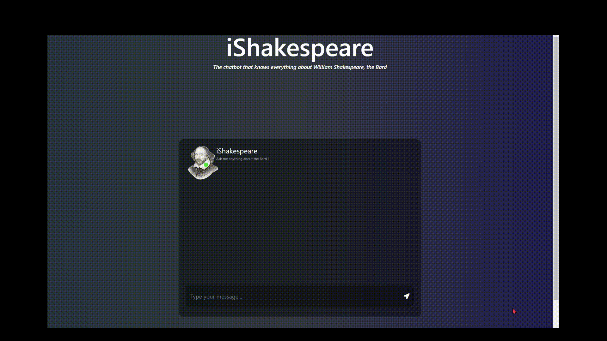

# iShakespeare



### Installation

**Virtual Environment Setup**

Before setting up the virtual environment, ensure that you have Python 3.9 or higher installed on your system, then proceed according to the following steps:
1. Clone the project repository: `https://github.com/OneLeoTav/iShakespeare.git/`
2. Create a virtual environment: `virtualenv env` on Linux/MacOS or `python -m venv venv` on Windows
3. Then activate the virtual environment:
- On Linux/MacOS:
  ```bash
  virtualenv env && source env/bin/activate
  ```
- On Windows:
    ```bash
    python -m virtualenv env && source env/Scripts/activate
    ```
4. Install project dependencies: `pip install -r requirements.txt`
5. Launch the application locally: `python -B app.py`
6. Open your preferred web brower and access: http://127.0.0.1:2424/

## Project Outline
Step into the world of Shakespearean literature with iShakespeare, a chatbot designed to be your personal guide through the works and life of the Bard himself. Powered by advanced natural language processing techniques, including text pre-processing and neural network, iShakespeare is your gateway to Shakespearean wisdom. Chat, learn, and explore the world of Shakespeare with ease and delight.

### Main Features
1. **Conversational:** Engage in both contextual and real-time dialogue with our chatbot.
2. **General Information:** Discover insights into Shakespeare's life, work, and legacy.
3. **Anecdotes:** Delight in anecdotes and trivia about the Bard and his timeless creations.
3. **Contextual Awareness:** Keep track of previous messages within the conversation for a seamless user experience.

### Frameworks and Programming Languages Used
- **Python:** Used for backend development and integration of natural language processing techniques.
- **Flask:** Web framework for building the chatbot interface.
- **PyTorch:** Used to train and test our neural network.
- **HTML/CSS/JavaScript:** Utilized to create the responsive front-end and an applealing chat interface.
- **PyTest:** Employed for automated testing, ensuring the reliability and robustness of the application under different scenarios.
- **Jupyter Notebook:** Utilized for development prior to production. The notebook is available in the same repository at [iShakespeare.ipynb](https://github.com/OneLeoTav/GenerativeWizard/blob/main/iShakespeare.ipynb).

## Aperçu du Projet
Découvrez les prévisions météorologiques en temps réel avec notre application Web. En utilisant les capacités de Flask et Bokeh, cette plateforme ergonomique fournit aux utilisateurs des visualisations intuitives et interactives des prévisions météorologiques pour les villes de France. Des fluctuations de température à la carte des vents, aux niveaux d'humidité et de pluviométrie, restez informé et préparé avec notre outil de visualisation météorologique dynamique.

**Principales fonctionnalités :**
1. **Conversationel :** Engagez un dialogue avec notre chatbot, avec des réponses contextuelles, en temps réel. 
2. **Informations générales :** Découvrez des informations sur la vie, l'œuvre et l'héritage de Shakespeare.
4. **Anecdotes :** Délectez-vous d’anecdotes sur le Barde et ses créations intemporelles.
5. **Historique de Conversation :** L’interface de chat est conçue de telle façon qu'au cours d’une session, les échanges précédents demeurent visibles.


**Technologie utilisées :**
- **Python :** Utilisé pour le développement backend et l'intégration des techniques de traitement du langage naturel.
- **Flask :** Framework web pour la construction de l'interface du chatbot.
- **PyTorch :** Utilisé pour entraîner et tester notre réseau neuronal.
- **HTML/CSS/JavaScript :** Utilisés pour créer l'interface frontale responsive.
- **PyTest :** Employé pour les tests.
- **Jupyter Notebook :** Utilisé pour le développement pré-production. Le notebook est disponible sur ce repository[iShakespeare.ipynb](https://github.com/OneLeoTav/GenerativeWizard/blob/main/iShakespeare.ipynb).

## Panorama del Proyecto
Sumérgete en el mundo de la literatura shakesperiana con iShakespeare, nuestro chatbot diseñado para guiarte a través de las obras y la vida del Bardo. Basado en técnicas avanzadas de procesamiento del lenguaje natural así como en una red neuronal, este chatbot te permite abrazar la sabiduría de Shakespeare. ¡Conversa, aprende y explora el mundo de Shakespeare con facilidad y placer!


**Funcionalidades principales:**
1. **Conversación:** Entabla un diálogo en vivo con nuestro chatbot iShakespeare.
2. **Información general:** Descubre datos sobre la vida, obra y legado de Shakespeare.
3. **Anécdotas:** Disfruta de anécdotas sobre el Bardo y sus creaciones atemporales.
4. **Historial de conversación:** La interfaz de chat está diseñada para que durante una sesión, los intercambios anteriores sigan siendo visibles.


**Tecnologías utilizadas:**
- **Python:** Utilizado para el desarrollo backend e integración de técnicas de procesamiento del lenguaje natural.
- **Flask:** Framework web para la construcción de la interfaz del chatbot.
- **PyTorch:** Empleado para entrenar y probar nuestra red neuronal.
- **HTML/CSS/JavaScript:** Utilizados para crear la interfaz frontal receptiva.
- **PyTest:** Utilizado para pruebas automatizadas.
- **Jupyter Notebook :** Utilizado para la fase de desarrollo, previo a la producción. El notebook está disponible en el mismo repository [iShakespeare.ipynb](https://github.com/OneLeoTav/GenerativeWizard/blob/main/iShakespeare.ipynb).
